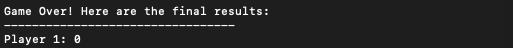

# Ourhood: Real-Time Streaming Quiz Game

## Introduction  
Introducing Ourhood — a dynamic, real-time multiplayer trivia game built with Java! Challenge your friends or get paired with random opponents in an exciting, high-speed quiz competition. Ourhood leverages Java’s Datagram and Socket classes to create a TCP-based communication framework, ensuring smooth, dependable connections between clients and the server throughout every match.

## Features

### Gaming:
- **Live Multiplayer Functionality**: Multiple users can play simultaneously in real-time.  
- **Multiple-Choice Questions**: Players respond to trivia questions with four selectable answer options
- **Built-in Timers**: Time constraints for various game phases — such as player response time, score updates, and game pacing
- **Host Modification**: The host can customize game by selecting quiz category, number of questions, and allotted time per question
- **Points Calculator**: The system awarded 1 point for every question that a player answers correctly and 0 for invalid answer or player choosing not to answer. After the end of the game, the system will anounced player who has the highest score as the winner

### Technical:

- **Client-Server Model**: Ourhood uses the Transmission Control Protocol (TCP) to ensure stable and consistent message exchange between the server and connected clients. TCP provides essential features like reliable transmission, ordered message delivery, flow control, and connection-oriented communication. These are implemented using Java’s `Socket` class.  
- **Multithreading Support**: Java's `Thread` class is used to manage concurrent gameplay across multiple users efficiently.  
- **Synchronized Methods**: Shared resources are protected using Java's `synchronized` keyword to maintain data integrity in a multithreaded environment.  
- **Server-Side Logic**: The server is responsible for sending welcome messages, distributing quiz questions, validating answers, tracking scores, and generating final results.  
- **Timeout Handling**: If a player fails to respond, the server clears the input buffer to prepare for the next question.  

## Installation  
To set up and run Ourhood on your local device, follow these steps:  
1. Clone the Ourhood project repository.
2. Compile all Java source files using your preferred compiler.
3. Start the server program on one machine.  
4. Launch the host program on a separate device to configure the game session.  
5. Open the client program on one or more machines to allow players to join the game.

## How to Play  
1. Start the Server by running `java network/Server`.  

2. Run the Host setup with `java network/Host` to configure quiz settings.
  
3. Launch the Client application using `java network/Client` on separate terminals or devices.
   
4. Wait until all players have joined the lobby.  
5. Once the game begins, answer the questions within the given time limit.  
6. Points are awarded for correct answers.
    
7. The player with the highest score after all questions are answered wins the game!
  
